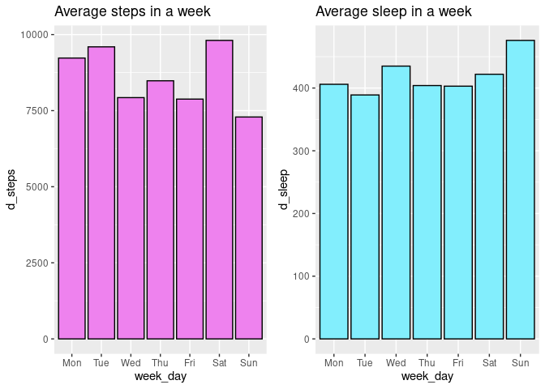
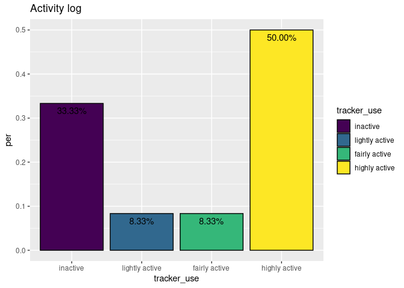
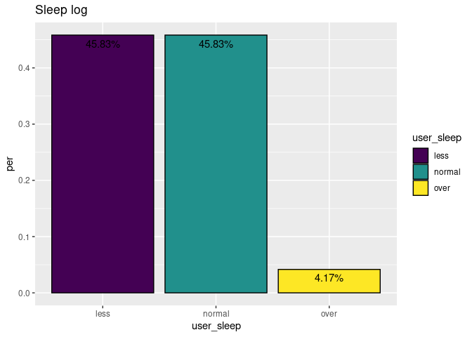
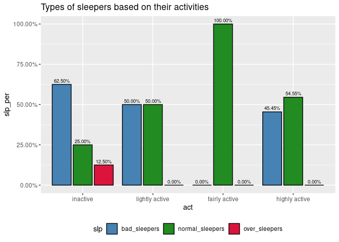

Project1
================
Mrudula
2022-10-27

# Introduction

Bellabeat is a high-tech company founded by Urška Sršen and Sando Mur.
It is a successful, small company that has potential to grow in the
global smart device market. Since it’s founding in 2013, Bellabeat
quickly positioned itself as a tech-driven wellness company for women.

The co-founder and Chief Creative Officer of Bellabeat, Urška Sršen,
believes that analyzing the smart device data could help gain insights
into new growth opportunities for the company.

We’ll have to analyze the data and present it to the executive team.

The dataset contains daily activities like total steps, total distance
walked, inactive minutes, total minutes asleep, etc., for a month.

### Source of the dataset

This dataset is made available by Mobius under a CC0 license in Kaggle.

## Setting up the environment

First, we’ll install the packages we will be needing. Use
`install.packages()` function to install them. And then the `library()`
function to load them.

``` r
library(tidyverse)
library(lubridate)
library(formattable)
library(cowplot)
```

-   The `tidyverse` is a collection of R packages designed for data
    science.

-   `lubridate` makes it easier to work with dates and times.

-   `formattable` is for applying formatting on vectors and data frames
    to make data presentation easier.

-   `cowplot` provides various features that help with creating
    publication-quality figures. It provides functions to align plots
    and arrange them into complex figures.

## Importing the datasets

First, we’ll import the `.csv` files and assign them to variables so
that they will be easy to access later. We’ll use `read_csv()` function
to import the files.

``` r
activity <- read_csv("dailyActivity_merged.csv")
```

    ## Rows: 940 Columns: 15
    ## ── Column specification ────────────────────────────────────────────────────────
    ## Delimiter: ","
    ## chr  (1): ActivityDate
    ## dbl (14): Id, TotalSteps, TotalDistance, TrackerDistance, LoggedActivitiesDi...
    ## 
    ## ℹ Use `spec()` to retrieve the full column specification for this data.
    ## ℹ Specify the column types or set `show_col_types = FALSE` to quiet this message.

``` r
sleep <- read_csv("sleepDay_merged.csv")
```

    ## Rows: 413 Columns: 5
    ## ── Column specification ────────────────────────────────────────────────────────
    ## Delimiter: ","
    ## chr (1): SleepDay
    ## dbl (4): Id, TotalSleepRecords, TotalMinutesAsleep, TotalTimeInBed
    ## 
    ## ℹ Use `spec()` to retrieve the full column specification for this data.
    ## ℹ Specify the column types or set `show_col_types = FALSE` to quiet this message.

``` r
weight <- read_csv("weightLogInfo_merged.csv")
```

    ## Rows: 67 Columns: 8
    ## ── Column specification ────────────────────────────────────────────────────────
    ## Delimiter: ","
    ## chr (1): Date
    ## dbl (6): Id, WeightKg, WeightPounds, Fat, BMI, LogId
    ## lgl (1): IsManualReport
    ## 
    ## ℹ Use `spec()` to retrieve the full column specification for this data.
    ## ℹ Specify the column types or set `show_col_types = FALSE` to quiet this message.

From the column specifications, we know that the `activity` dataframe
has 940 rows and 15 columns, `sleep` has 413 rows and 5 columns,
`weight` has 67 rows and 8 columns.

Now, rename the column names to lowercase for easier access. We can use
`rename_with()` function to rename. As for the arguments, give the
specific dataframe and a function that will be used to transform the
selected columns.

In this case, we are renaming every column in the dataframe; so we’ll
use `tolower`.

``` r
activity <- rename_with(activity, tolower)
sleep <- rename_with(sleep, tolower)
weight <- rename_with(weight, tolower)
```

Check the column names just to be certain. Use `colnames()` function to
do so.

``` r
colnames(activity)
```

    ##  [1] "id"                       "activitydate"            
    ##  [3] "totalsteps"               "totaldistance"           
    ##  [5] "trackerdistance"          "loggedactivitiesdistance"
    ##  [7] "veryactivedistance"       "moderatelyactivedistance"
    ##  [9] "lightactivedistance"      "sedentaryactivedistance" 
    ## [11] "veryactiveminutes"        "fairlyactiveminutes"     
    ## [13] "lightlyactiveminutes"     "sedentaryminutes"        
    ## [15] "calories"

``` r
colnames(sleep)
```

    ## [1] "id"                 "sleepday"           "totalsleeprecords" 
    ## [4] "totalminutesasleep" "totaltimeinbed"

``` r
colnames(weight)
```

    ## [1] "id"             "date"           "weightkg"       "weightpounds"  
    ## [5] "fat"            "bmi"            "ismanualreport" "logid"

Let’s check how many participants were involved. Use `n_distinct()`
function for that. Since we need distinct values of the column `id`, we
use the `$` sign, which makes the function limit to the specific column.

``` r
n_distinct(activity$id)
```

    ## [1] 33

``` r
n_distinct(sleep$id)
```

    ## [1] 24

``` r
n_distinct(weight$id)
```

    ## [1] 8

33 participants recorded their regular activities, 24 participants
recorded their sleep activities while only 8 participants recorded their
weight.

It is understandable. Many would not be comfortable with sharing details
regarding their weight.

Since there is not enough data (there are only 64 observations) in the
weight data frame, let’s put that aside.

Take a glimpse at the nature of each variable in the data frames. Use
`glimpse()` function to do so.

``` r
glimpse(activity)
```

    ## Rows: 940
    ## Columns: 15
    ## $ id                       <dbl> 1503960366, 1503960366, 1503960366, 150396036…
    ## $ activitydate             <chr> "04-12-2016", "4/13/2016", "4/14/2016", "4/15…
    ## $ totalsteps               <dbl> 13162, 10735, 10460, 9762, 12669, 9705, 13019…
    ## $ totaldistance            <dbl> 8.50, 6.97, 6.74, 6.28, 8.16, 6.48, 8.59, 9.8…
    ## $ trackerdistance          <dbl> 8.50, 6.97, 6.74, 6.28, 8.16, 6.48, 8.59, 9.8…
    ## $ loggedactivitiesdistance <dbl> 0, 0, 0, 0, 0, 0, 0, 0, 0, 0, 0, 0, 0, 0, 0, …
    ## $ veryactivedistance       <dbl> 1.88, 1.57, 2.44, 2.14, 2.71, 3.19, 3.25, 3.5…
    ## $ moderatelyactivedistance <dbl> 0.55, 0.69, 0.40, 1.26, 0.41, 0.78, 0.64, 1.3…
    ## $ lightactivedistance      <dbl> 6.06, 4.71, 3.91, 2.83, 5.04, 2.51, 4.71, 5.0…
    ## $ sedentaryactivedistance  <dbl> 0, 0, 0, 0, 0, 0, 0, 0, 0, 0, 0, 0, 0, 0, 0, …
    ## $ veryactiveminutes        <dbl> 25, 21, 30, 29, 36, 38, 42, 50, 28, 19, 66, 4…
    ## $ fairlyactiveminutes      <dbl> 13, 19, 11, 34, 10, 20, 16, 31, 12, 8, 27, 21…
    ## $ lightlyactiveminutes     <dbl> 328, 217, 181, 209, 221, 164, 233, 264, 205, …
    ## $ sedentaryminutes         <dbl> 728, 776, 1218, 726, 773, 539, 1149, 775, 818…
    ## $ calories                 <dbl> 1985, 1797, 1776, 1745, 1863, 1728, 1921, 203…

``` r
glimpse(sleep)
```

    ## Rows: 413
    ## Columns: 5
    ## $ id                 <dbl> 1503960366, 1503960366, 1503960366, 1503960366, 150…
    ## $ sleepday           <chr> "4/12/2016 12:00:00 AM", "4/13/2016 12:00:00 AM", "…
    ## $ totalsleeprecords  <dbl> 1, 2, 1, 2, 1, 1, 1, 1, 1, 1, 1, 1, 1, 1, 1, 1, 1, …
    ## $ totalminutesasleep <dbl> 327, 384, 412, 340, 700, 304, 360, 325, 361, 430, 2…
    ## $ totaltimeinbed     <dbl> 346, 407, 442, 367, 712, 320, 377, 364, 384, 449, 3…

## Data Cleaning and Transforming

Check for duplicated values. Use `duplicated()` function. This function
return Boolean values as an output. `FALSE` when there is no duplicate
value and `TRUE` when there is a duplicate value.

We use the `sum()` function. It returns the number of duplicate values.

``` r
sum(duplicated(activity))
```

    ## [1] 0

``` r
sum(duplicated(sleep))
```

    ## [1] 3

There seem to be duplicate values in sleep data frame. Let’s remove
them. Use `distinct()` for that. `distinct()` is used to select only
unique or distinct rows from a data frame.

``` r
sleep <- sleep %>%
  distinct() 
```

Now, let’s check again.

``` r
sum(duplicated(sleep))
```

    ## [1] 0

Check for null values in the same way. Use `is.null()` function for
that.

``` r
sum(is.null(activity))
```

    ## [1] 0

``` r
sum(is.null(sleep))
```

    ## [1] 0

There are no null values. Now for the missing values, we will use the
`is.na()` function.

``` r
sum(is.na(activity))
```

    ## [1] 0

``` r
sum(is.na(sleep))
```

    ## [1] 0

There are no missing values as well.

We need to merge the data frames into one. This is to find relation
between the two. First, we need to find the variables that are common in
both data frames. `id` and `date` seem to be common.

But `date` is in different formats. We’ll convert into a format, so that
it will be easier for us to proceed. First, we will rename the column
and use `as_date()` function to convert the date format.

`mutate()` makes changes to the dataframe; while preserving existing
variables.

``` r
activity <- activity %>%
  rename(date = activitydate) %>%
  mutate(date = as_date(date, 
                        format = "%m/%d/%Y"))
```

Now in the `sleep` dataframe. Rename the column name so that it’s the
same as in the `activity` dataframe.

``` r
sleep <- sleep %>%
  rename(date = sleepday) %>%
  mutate(date = as_date(date, 
                        format = "%m/%d/%Y %I:%M:%S %p",
                        tz = Sys.timezone()))
```

`%m/%d/%Y` helps to convert the date into the format month-date-year.
While `%M:%S` denotes minutes and seconds, `%I` denotes hours as decimal
in 12 hour format and the `%p` denotes the locale-specific AM/PM. `tz`
is the timezone. `Sys.timezone()` denotes the timezone of the system.

Merge the data frames. Use the `merge()` function for that.

``` r
combined <- merge(activity, sleep, by = c("id", "date"))
```

In this piece of code, the data frames `activity` and `sleep` are merged
by `date` and `id`. These two columns are common in both data frames.

Now, let’s have a glimpse at the data.

``` r
glimpse(combined)
```

    ## Rows: 251
    ## Columns: 18
    ## $ id                       <dbl> 1503960366, 1503960366, 1503960366, 150396036…
    ## $ date                     <date> 2016-04-13, 2016-04-15, 2016-04-16, 2016-04-…
    ## $ totalsteps               <dbl> 10735, 9762, 12669, 9705, 15506, 10544, 9819,…
    ## $ totaldistance            <dbl> 6.97, 6.28, 8.16, 6.48, 9.88, 6.68, 6.34, 9.0…
    ## $ trackerdistance          <dbl> 6.97, 6.28, 8.16, 6.48, 9.88, 6.68, 6.34, 9.0…
    ## $ loggedactivitiesdistance <dbl> 0, 0, 0, 0, 0, 0, 0, 0, 0, 0, 0, 0, 0, 0, 0, …
    ## $ veryactivedistance       <dbl> 1.57, 2.14, 2.71, 3.19, 3.53, 1.96, 1.34, 2.8…
    ## $ moderatelyactivedistance <dbl> 0.69, 1.26, 0.41, 0.78, 1.32, 0.48, 0.35, 0.8…
    ## $ lightactivedistance      <dbl> 4.71, 2.83, 5.04, 2.51, 5.03, 4.24, 4.65, 5.3…
    ## $ sedentaryactivedistance  <dbl> 0, 0, 0, 0, 0, 0, 0, 0, 0, 0, 0, 0, 0, 0, 0, …
    ## $ veryactiveminutes        <dbl> 21, 29, 36, 38, 50, 28, 19, 41, 39, 73, 31, 4…
    ## $ fairlyactiveminutes      <dbl> 19, 34, 10, 20, 31, 12, 8, 21, 5, 14, 23, 28,…
    ## $ lightlyactiveminutes     <dbl> 217, 209, 221, 164, 264, 205, 211, 262, 238, …
    ## $ sedentaryminutes         <dbl> 776, 726, 773, 539, 775, 818, 838, 732, 709, …
    ## $ calories                 <dbl> 1797, 1745, 1863, 1728, 2035, 1786, 1775, 194…
    ## $ totalsleeprecords        <dbl> 2, 1, 2, 1, 1, 1, 1, 1, 1, 1, 1, 1, 1, 1, 1, …
    ## $ totalminutesasleep       <dbl> 384, 412, 340, 700, 304, 360, 325, 361, 430, …
    ## $ totaltimeinbed           <dbl> 407, 442, 367, 712, 320, 377, 364, 384, 449, …

There are 251 observations and 18 columns. Let’s see how many members
recorded both their activities and sleep details.

``` r
n_distinct(combined$id)
```

    ## [1] 24

Now, let’s get a statistical summary of the combined data frame.

``` r
combined %>%
  select(totalsteps,
         totaldistance,
         sedentaryminutes,
         totalminutesasleep,
         calories) %>%
  summary()
```

    ##    totalsteps    totaldistance    sedentaryminutes totalminutesasleep
    ##  Min.   :   42   Min.   : 0.030   Min.   :   2.0   Min.   : 59.0     
    ##  1st Qu.: 5204   1st Qu.: 3.620   1st Qu.: 646.0   1st Qu.:361.0     
    ##  Median : 9105   Median : 6.280   Median : 721.0   Median :430.0     
    ##  Mean   : 8583   Mean   : 6.077   Mean   : 724.0   Mean   :418.5     
    ##  3rd Qu.:11390   3rd Qu.: 8.065   3rd Qu.: 781.5   3rd Qu.:487.0     
    ##  Max.   :22359   Max.   :17.190   Max.   :1265.0   Max.   :775.0     
    ##     calories   
    ##  Min.   : 403  
    ##  1st Qu.:1881  
    ##  Median :2200  
    ##  Mean   :2415  
    ##  3rd Qu.:2908  
    ##  Max.   :4900

A quick summary and assumptions:

-   The minimum a person walked is 42 steps. While maximum is 22359
    steps. We can make various assumptions here. Since we calculated the
    mean for all the observations, we cannot be certain that it belongs
    to the same person or different person. Perhaps the person who
    walked the least, used the device for little time and their
    activities were not recorded despite walking a lot. And the person
    who walked the most had an outdoor job that involves more walking.
    Or maybe they were the type of person, who walks while reflecting
    upon themselves.

-   The statistics of the distance and calories might be related with
    the steps walked.

-   Maximum of sedentary minutes is 1265 minutes. There are many
    assumptions here as well. Maybe that person was injured or sick and
    was bed-ridden.

-   Maximum a person slept was 775 minutes. Which roughly equals to 12
    hours. Maybe that person took a nap in the middle of the day and
    that was recorded in the device. Or they might have been tired and
    overslept. The minimum a person slept was 59 minutes - which is one
    hour. There is a possibility that their activities are not recorded.

This is where many questions arise. Questions like:

-   How many days each participant used the device?

-   How many hours per day was the device used?

-   How are the activities of the participants during weekdays and
    weekends?

-   How are the sleep times of the participants according to the
    intensity of their activities?

Going further, first we’ll see how many days the participants used the
smart device. We’ll categorize their usage according to that.

First, we’ll group the observations by `id`. Then add the number of
times the person recorded their activities by using `sum()` function.
Assign it to the a variable. Then create a factor. Categorize the data
and store them on multiple levels. Use multiple functions like
`mutate()`, `factor()` and `case_when()` functions to do so.

Convert the values to percentage by using `percent()` function from
`formattable` package.

``` r
device_use <- combined %>%
  group_by(id) %>%
  summarize(days_used = sum(n())) %>%
  mutate(days = factor(case_when(
    days_used >= 1 & days_used <= 10 ~ "low",
    days_used >= 11 & days_used <= 22 ~ "moderate",
    days_used >= 23  ~ "high"
  ), levels = c("high", "moderate", "low"), 
  ordered = TRUE)) %>%
    group_by(days) %>%
  summarize(total = n()) %>%
  mutate(total_d = sum(total)) %>%
  group_by(days) %>%
  summarize(dev_per = percent(total / total_d))

print(device_use)
```

    ## # A tibble: 2 × 2
    ##   days     dev_per   
    ##   <ord>    <formttbl>
    ## 1 moderate 58.33%    
    ## 2 low      41.67%

Among 24 participants; 58.33%, that is 14 used the device moderately,
while the other 41.67% - 10 had used very little.

Now we’ll need to find how many hours or minutes in a day they used the
device.

Calculate how many hours the participant used the device in a day. We’ll
calculate it in minutes. A day has 1,440 minutes. According to that less
than half a day is 360 minutes, half day is 720 minutes and more than
half a day is 1080 minutes.

First we’ll need to add `veryactiveminutes`, `fairlyactiveminutes`,
`lightlyactiveminutes`, and `sedentaryminutes`; because these columns
seem to describe the active minutes in a day. Now once again, group by
id. And create a factor.

``` r
mins_usage <- combined %>%
  group_by(id) %>%
  mutate(mins_used = veryactiveminutes + fairlyactiveminutes + lightlyactiveminutes + sedentaryminutes) %>%
  summarize(mins = factor(case_when(
    mins_used >= 1 & mins_used <= 360 ~ "less than half day",
    mins_used >= 370 & mins_used <= 720 ~ "half day",
    mins_used >= 730 & mins_used <= 1080 ~ "more than half day",
    mins_used >= 1090 & mins_used <= 1440 ~ "full day"
  ), 
  levels = c("less than half day", "half day", "more than half day", "full day"),
  ordered = TRUE)) %>%
  group_by(mins) %>%
  summarize(total = n()) %>%
  mutate(total_m = sum(total)) %>%
  group_by(mins) %>%
  summarize(min_per = percent(total / total_m)) %>%
  drop_na()

print(mins_usage)
```

    ## # A tibble: 4 × 2
    ##   mins               min_per   
    ##   <ord>              <formttbl>
    ## 1 less than half day 0.40%     
    ## 2 half day           2.79%     
    ## 3 more than half day 82.47%    
    ## 4 full day           12.75%

On weekends, working adults tend to rest. However, some still exercise.
Depending on the person, they might increase or decrease the intensity.
Let’s see how their activities are on weekdays and weekends. The same
with sleep. Some might sleep less and some might sleep more.

First, use the `weekdays()` function to find out the days of the week.
Then we can summarize it. The parameter `abbreviate` abbreviates string
characters to minimum length characters.

``` r
weekday_rec <- combined %>%
  mutate(week_day = weekdays(date, abbreviate = TRUE))
```

Now, create a factor with the names of the days.

``` r
weekday_rec$week_day <- factor(weekday_rec$week_day,
                              levels = c("Mon", "Tue", "Wed", "Thu", "Fri", "Sat", "Sun"),
                              ordered = TRUE)
```

Let’s summarize. We’ll also change the data type of the columns, for
simpler access. For that, use `as.integer()` function.

Convert the mean of `totalsteps` and `totalminutesasleep` and convert
them into integers for easier analysis. Use `as.integer()` function for
that.

``` r
weekday_rec <- weekday_rec %>%
  group_by(week_day) %>%
  summarize(d_steps = mean(totalsteps), d_sleep = mean(totalminutesasleep)) %>%
  mutate(d_steps = as.integer(d_steps),
         d_sleep = as.integer(d_sleep))

print(weekday_rec)
```

    ## # A tibble: 7 × 3
    ##   week_day d_steps d_sleep
    ##   <ord>      <int>   <int>
    ## 1 Mon         9228     406
    ## 2 Tue         9596     389
    ## 3 Wed         7928     435
    ## 4 Thu         8481     404
    ## 5 Fri         7879     403
    ## 6 Sat         9808     422
    ## 7 Sun         7291     476

Now, we’ll see how active the participants are.

Most fitness tracking devices are programmed to set a goal of 10,000
steps per day. We’ll calculate according to that.

We’ll create a factor and assign the values to levels. Compare them to
the mean of `totalsteps`.

``` r
tracker <- combined %>%
  group_by(id) %>%
  summarize(steps = mean(totalsteps)) %>%
  mutate(tracker_use = factor(case_when(
    steps <= 5000 ~ "inactive",
    steps > 5000 & steps <= 7500 ~ "lightly active",
    steps > 7500 & steps <= 9000 ~ "fairly active",
    steps > 9000 ~ "highly active"
  ), levels = c("inactive", "lightly active", "fairly active", "highly active"),
  ordered = TRUE)) %>%
  group_by(tracker_use) %>%
  summarize(total = n()) %>%
  mutate(totals = sum(total)) %>%
  group_by(tracker_use) %>%
  summarize(per = percent(total / totals)) 

print(tracker)
```

    ## # A tibble: 4 × 2
    ##   tracker_use    per       
    ##   <ord>          <formttbl>
    ## 1 inactive       33.33%    
    ## 2 lightly active 8.33%     
    ## 3 fairly active  8.33%     
    ## 4 highly active  50.00%

We’ll do the same with sleep records as well. An average adult needs to
get 7-9 hours of sleep. However, we’ll calculate it in minutes. 400
minutes is about 6.6 hours of sleep. 420-540 means 7-9 hours of sleep.
550 means above 9 hours of sleep.

We’ll do same as above. Create a factor, assign them to levels, and
calculate percentage. In case there are missing values, use `drop_na()`
to drop them.

Generally, it is not a good idea to drop values, as we might be missing
important insights. Since these are recorded according to the activities
of the participant, there is no way for us to fill them in. So, it would
be better to drop them.

``` r
sleep_track <- combined %>%
  group_by(id) %>%
  summarize(total_sleep = mean(totalminutesasleep)) %>%
  mutate(user_sleep = factor(case_when(
    total_sleep <= 400 ~ "less",
    total_sleep > 420 & total_sleep <= 540 ~ "normal",
    total_sleep > 550 ~ "over"
  ), levels = c("less", "normal", "over"),
  ordered = TRUE)) %>%
  group_by(user_sleep) %>%
  summarize(total = n()) %>%
  mutate(total_s = sum(total)) %>%
  group_by(user_sleep) %>%
  summarize(per = percent(total / total_s)) %>%
  drop_na() 

print(sleep_track)
```

    ## # A tibble: 3 × 2
    ##   user_sleep per       
    ##   <ord>      <formttbl>
    ## 1 less       45.83%    
    ## 2 normal     45.83%    
    ## 3 over       4.17%

Finally, we’ll see how good or bad of a sleepers each participant is
depending on how active or inactive they are.

Group each participant by their id, and create a factor for activity and
sleep. To compare them with, find the mean of `totalsteps` and
`totalminutesasleep`. Group by activity and categorize them according to
their sleeping habits.

``` r
act_sleep <- combined %>%
  group_by(id) %>%
  summarize(steps = mean(totalsteps), t_sleep = mean(totalminutesasleep)) %>%
  mutate(act = factor(case_when(
    steps <= 5000 ~ "inactive",
    steps > 5000 & steps <= 7500 ~ "lightly active",
    steps > 7500 & steps <= 9000 ~ "fairly active",
    steps > 9000 ~ "highly active"
  ), levels = c("inactive", "lightly active", "fairly active", "highly active"),
  ordered = TRUE),
  sleep_rec = factor(case_when(
    t_sleep <= 400 ~ "less",
    t_sleep > 420 & t_sleep <= 540 ~ "normal",
    t_sleep > 550 ~ "over"
  ), levels = c("less", "normal", "over"),
  ordered = TRUE)) %>%
  drop_na() %>%
  group_by(act) %>%
  summarize(slp = factor(case_when(
    sleep_rec == "less" ~ "bad_sleepers",
    sleep_rec == "normal" ~ "normal_sleepers",
    sleep_rec == "over" ~ "over_sleepers"),
    levels = c("bad_sleepers", "normal_sleepers", "over_sleepers"),
    ), total = n()) %>%
  mutate(
    bad_sleepers  = percent(sum(slp == "bad_sleepers") / total),
    normal_sleepers = percent(sum(slp == "normal_sleepers") / total),
    over_sleepers = percent(sum(slp == "over_sleepers") / total)
  ) %>%
  group_by(act) %>%
  select(-total, -slp) 

act_sleep <- print(unique(act_sleep))
```

    ## # A tibble: 4 × 4
    ## # Groups:   act [4]
    ##   act            bad_sleepers normal_sleepers over_sleepers
    ##   <ord>          <formttbl>   <formttbl>      <formttbl>   
    ## 1 inactive       62.50%       25.00%          12.50%       
    ## 2 lightly active 50.00%       50.00%          0.00%        
    ## 3 fairly active  0.00%        100.00%         0.00%        
    ## 4 highly active  45.45%       54.55%          0.00%

We’ll now reshape this. Use `gather()` function for that. It collects a
set of column names and places them into a single ‘key’ column.

``` r
as <- gather(act_sleep, slp, slp_per, bad_sleepers : over_sleepers, factor_key = TRUE)

print(as, n = 12)
```

    ## # A tibble: 12 × 3
    ## # Groups:   act [4]
    ##    act            slp             slp_per   
    ##    <ord>          <fct>           <formttbl>
    ##  1 inactive       bad_sleepers    62.50%    
    ##  2 lightly active bad_sleepers    50.00%    
    ##  3 fairly active  bad_sleepers    0.00%     
    ##  4 highly active  bad_sleepers    45.45%    
    ##  5 inactive       normal_sleepers 25.00%    
    ##  6 lightly active normal_sleepers 50.00%    
    ##  7 fairly active  normal_sleepers 100.00%   
    ##  8 highly active  normal_sleepers 54.55%    
    ##  9 inactive       over_sleepers   12.50%    
    ## 10 lightly active over_sleepers   0.00%     
    ## 11 fairly active  over_sleepers   0.00%     
    ## 12 highly active  over_sleepers   0.00%

## Visualizing the data

First, let’s start with the correlation. They might be obvious like how
the more steps a person takes, the more distance you cover. But let’s
see how the graphs look like.

``` r
g1 <- ggplot(combined) +
  geom_point(mapping = aes(x = totalsteps, y = totaldistance)) +
  geom_smooth(mapping = aes(x = totalsteps, y = totaldistance)) +
  labs(title = "Steps vs. Distance")

g2 <- ggplot(combined) +
  geom_point(mapping = aes(x = totalsteps, y = calories)) +
  geom_smooth(mapping = aes(x = totalsteps, y = calories)) +
  labs(title = "Steps vs. Calories")

g3 <- ggplot(combined) +
  geom_point(mapping = aes(x = totalsteps, y = totalminutesasleep)) + 
  geom_smooth(mapping = aes(x = totalsteps, y = totalminutesasleep)) +
  labs(title = "Steps vs. Sleep")

g4 <- ggplot(combined) +
  geom_point(mapping = aes(x = totalsteps, y = sedentaryminutes)) +
  geom_smooth(mapping = aes(x = totalsteps, y = sedentaryminutes)) +
  labs(title = "Steps vs. Sedentary minutes")
```

Combine all these graphs into one. Use `plot_grid()` function from the
`cowplot` package. The parameter `nrow` helps to assemble the graphs
into two rows.

``` r
plot_grid(g1, g2, g3, g4, nrow = 2)
```

<!-- -->

There is a positive correlation between total steps and total distance
covered. The same with total steps and calories burned. But it does not
seem like there is a relationship between total steps and total minutes
asleep; and the same goes with total steps and sedentary minutes.

Let’s proceed with other visualizations.

Visualize the logged activities on weekends.

``` r
w1 <- ggplot(weekday_rec) +
  geom_col(mapping = aes(x = week_day, y = d_steps), color = "black", fill = "violet") +
  labs(title = "Average steps in a week") 
  
w2 <- ggplot(weekday_rec) +
  geom_col(mapping = aes(x = week_day, y = d_sleep), color = "black", fill = "#82EEFD") +
  labs(title = "Average sleep in a week")
```

Put these two in a grid.

``` r
plot_grid(w1, w2)
```

<!-- -->

By putting the graphs in a grid, it helps to compare two graphs easily.

No matter on which day, the average steps taken did not reach the goal
of 10,000 steps. The sleep records seem to be better; as they are around
390-480 minutes, which is roughly around 6-7 hours. While 6 hours is a
bit less, 7 hours of sleep can be quite normal.

Now, let’s visualize their activities.

``` r
ggplot(tracker) +
  geom_col(mapping = aes(x = tracker_use, y = per, fill = tracker_use),
           color = "black") +
  geom_text(aes(x = tracker_use, y = per, label = per), vjust = 1.6) +
  labs(title = "Activity log")
```

<!-- -->

Among 23 participants; 33.33% of them, that is 8 of them are inactive,
50% - 12 of them are highly active. 8.33% - 2 of them are lightly active
and 8.33% - 2 of them are fairly active.

And as for their sleep records…

``` r
ggplot(sleep_track) +
  geom_col(mapping = aes(x = user_sleep, y = per, fill = user_sleep),
           color = "black") +
  geom_text(aes(x = user_sleep, y = per, label = per), vjust = 1.6) +
  labs(title = "Sleep log")
```

<!-- -->

45.83% - 11 of them have a record of sleeping for a less amount of time,
while 45.83% - 11 sleep just the normal. While 4.17% - 1 of them
oversleeps.

Finally, let’s visualize different types of sleepers based on their
activities.

``` r
ggplot(as) +
  geom_bar(mapping = aes(x = act, y = slp_per, fill = slp), color = "black",
           position = position_dodge2(preserve = "single"), stat = "identity") +
  scale_fill_manual(values = c("#4682B4", "#228B22", "#DC143C")) +
  scale_y_continuous(labels = formattable :: percent) +
  geom_text(aes(x = act, y = slp_per, label = slp_per), 
            position = position_dodge2(preserve = "single",width = 0.9),
            vjust = -0.5,
            size = 2.5) +
  labs(title = "Types of sleepers based on their activities") +
  theme(legend.position = "bottom")
```

<!-- -->

`position_dodge()` function adjusts position by dodging overlaps to the
side. `preserve` parameter lets the function know if the dodging should
preserve the total width of all elements or the width of a single
element.

`scale_fill_manual()` function allows us to specify our own set of
mappings - from levels in the data to aesthetic values. In this case,
it’s color codes. `scale_y_continuous()` is used to set values for
continuous y-axis scale aesthetics. In this case, it’s percentage. The
argument `vjust` is used to move the location of the plot elements
vertically.

## Summary and Conclusions:

-   Most participants used their devices moderately. And every
    participant on each day they logged their activities, they used for
    more than half a day. While sometimes they used for an entire day.

-   Most of the participants exercised the most on Saturdays and least
    on Sundays. They slept most on Sundays.

-   There does not seem to be any correlation between steps taken per
    day and total minutes asleep. It can mean both ways. A few people,
    tired from all the exercising, tend to sleep well. Others might
    sleep less.

-   About 50% of the participants are highly active, while the others
    were either inactive of fairly active. Those kind of participants
    might be inactive. Or they might be busy that they could not
    exercise. For those participants, it would be better to remind them
    via a notification. Like suggesting them to take a walk.

-   45.83% of them sleep little, while other 45.83% of them maintain
    normal sleeping habits. For people who would want to live a fit and
    healthy life, it is better to remind them to go to sleep on time; so
    that they can have enough sleep.

-   Most of the inactive people are either bad sleepers or normal
    sleepers. While some of them still oversleep. Lightly active people
    are either bad sleepers or normal sleepers. Fairly active people are
    normal sleepers. Most highly active people are normal sleepers,
    while a few of them are bad sleepers.

-   There is not enough data regarding the weight details of the
    participants. They might be insecure about it, but might still want
    to lose weight. Rather than having to record their weight on daily
    basis, it would be better to motivate them to record their weight
    frequently. And also suggesting a healthy diet for them would be of
    help.

-   Despite all the speculations and analysis, it is safe to say that
    there is not enough data. As analysis for 23 participants would
    benefit them only. We need to collect more data so that the analysis
    can help and benefit a lot of people.

# Thank You.
