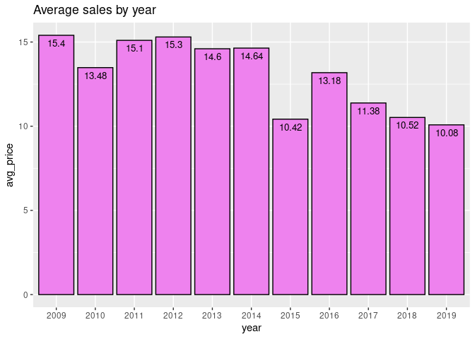

Project2
================
Mrudula
2022-10-28

# Amazon Top 50 Best Selling Books

This data is made available by Sooter Saalu under a CC0 license in
Kaggle. It shows the records of best selling books in Amazon from 2009
to 2019.

## Setting up my environment

First we install the packages we need, using the `install.packages()`
function. And then the `library()` function to load the packages.

``` r
library(tidyverse)
library(cowplot)
```

-   `tidyverse` is a collection of R packages used for data analysis.

-   `cowplot` provides functions to align plots and arrange them into
    complex figures.

## Importing the data

We import the `.csv` file using `read_csv()` function and assign it to a
variable for easier access.

``` r
amazon <- read_csv("bestsellers with categories.csv")
```

    ## Rows: 550 Columns: 7
    ## ── Column specification ────────────────────────────────────────────────────────
    ## Delimiter: ","
    ## chr (3): Name, Author, Genre
    ## dbl (4): User Rating, Reviews, Price, Year
    ## 
    ## ℹ Use `spec()` to retrieve the full column specification for this data.
    ## ℹ Specify the column types or set `show_col_types = FALSE` to quiet this message.

Let’s check the column names.

``` r
colnames(amazon)
```

    ## [1] "Name"        "Author"      "User Rating" "Reviews"     "Price"      
    ## [6] "Year"        "Genre"

To make it easier to access and analyze, let’s rename the column names.
Change them to lower case and rename any columns if necessary.

``` r
amazon <- rename_with(amazon, tolower)
colnames(amazon)[3] <- "rating"
```

Now, let’s have a glimpse at the data. For that, we use the `glimpse()`
function.

``` r
glimpse(amazon)
```

    ## Rows: 550
    ## Columns: 7
    ## $ name    <chr> "10-Day Green Smoothie Cleanse", "11/22/63: A Novel", "12 Rule…
    ## $ author  <chr> "JJ Smith", "Stephen King", "Jordan B. Peterson", "George Orwe…
    ## $ rating  <dbl> 4.7, 4.6, 4.7, 4.7, 4.8, 4.4, 4.7, 4.7, 4.7, 4.6, 4.6, 4.6, 4.…
    ## $ reviews <dbl> 17350, 2052, 18979, 21424, 7665, 12643, 19735, 19699, 5983, 23…
    ## $ price   <dbl> 8, 22, 15, 6, 12, 11, 30, 15, 3, 8, 8, 2, 32, 5, 17, 4, 6, 6, …
    ## $ year    <dbl> 2016, 2011, 2018, 2017, 2019, 2011, 2014, 2017, 2018, 2016, 20…
    ## $ genre   <chr> "Non Fiction", "Fiction", "Non Fiction", "Fiction", "Non Ficti…

## Data Cleaning and Transformation

Change the attribute of columns, so that analyzing the data will be
easier.

``` r
amazon <- amazon %>%
  mutate(price = as.integer(price),
         year = factor(amazon$year,
                        levels = c("2009", "2010", "2011", "2012", "2013",
                                   "2014", "2015", "2016", "2017", "2018", 
                                   "2019"),
                       ordered = TRUE))
```

Let’s see the attribute of each column now. Use `sapply()` function for
that. This function helps us in applying functions on a list, vector, or
a data frame and returns an array or matrix object of the same length.

``` r
sapply(amazon, class)
```

    ## $name
    ## [1] "character"
    ## 
    ## $author
    ## [1] "character"
    ## 
    ## $rating
    ## [1] "numeric"
    ## 
    ## $reviews
    ## [1] "numeric"
    ## 
    ## $price
    ## [1] "integer"
    ## 
    ## $year
    ## [1] "ordered" "factor" 
    ## 
    ## $genre
    ## [1] "character"

Check for duplicate values. We can do that by using the `duplicated()`
function. Since there are many values, we add the `sum()` function.

The `duplicated()` function returns Boolean values; as in `TRUE` or
`FALSE`. If there are duplicate values, we might miss it by accident as
there are many values. This is where the `sum()` function can help us.
It returns the sum of duplicate values. Then, we can check for them.

``` r
sum(duplicated(amazon))
```

    ## [1] 0

This shows us that there are no duplicate values. Now, let’s go ahead
and check for null values.

``` r
sum(is.null(amazon))
```

    ## [1] 0

There are no null values as well. This time, we will check for missing
values.

``` r
sum(is.na(amazon))
```

    ## [1] 0

There are no missing values in the data.

## Taking a brief look at the data

Let’s take a look at the first few and last few records in the dataset,
to understand the data a little bit more.

``` r
head(amazon)
```

    ## # A tibble: 6 × 7
    ##   name                                   author rating reviews price year  genre
    ##   <chr>                                  <chr>   <dbl>   <dbl> <int> <ord> <chr>
    ## 1 10-Day Green Smoothie Cleanse          JJ Sm…    4.7   17350     8 2016  Non …
    ## 2 11/22/63: A Novel                      Steph…    4.6    2052    22 2011  Fict…
    ## 3 12 Rules for Life: An Antidote to Cha… Jorda…    4.7   18979    15 2018  Non …
    ## 4 1984 (Signet Classics)                 Georg…    4.7   21424     6 2017  Fict…
    ## 5 5,000 Awesome Facts (About Everything… Natio…    4.8    7665    12 2019  Non …
    ## 6 A Dance with Dragons (A Song of Ice a… Georg…    4.4   12643    11 2011  Fict…

Now for the last few rows.

``` r
tail(amazon)
```

    ## # A tibble: 6 × 7
    ##   name                                   author rating reviews price year  genre
    ##   <chr>                                  <chr>   <dbl>   <dbl> <int> <ord> <chr>
    ## 1 Wonder                                 R. J.…    4.8   21625     9 2017  Fict…
    ## 2 Wrecking Ball (Diary of a Wimpy Kid B… Jeff …    4.9    9413     8 2019  Fict…
    ## 3 You Are a Badass: How to Stop Doubtin… Jen S…    4.7   14331     8 2016  Non …
    ## 4 You Are a Badass: How to Stop Doubtin… Jen S…    4.7   14331     8 2017  Non …
    ## 5 You Are a Badass: How to Stop Doubtin… Jen S…    4.7   14331     8 2018  Non …
    ## 6 You Are a Badass: How to Stop Doubtin… Jen S…    4.7   14331     8 2019  Non …

By looking at the last few rows, we can tell that there are a few books
that are entered by each year.

We cannot delete them, in case they are needed later. Instead, we can
find out how many books are there. And how many authors are there.

``` r
nrow(amazon)
```

    ## [1] 550

There are a total of 550 records in this dataset.

``` r
n_distinct(amazon$name)
```

    ## [1] 351

Among them, there are 351 books.

``` r
n_distinct(amazon$author)
```

    ## [1] 248

And 248 authors.

## Analyzing the data

First, we find out the genres. From the first and last rows, we can tell
that there are only two genres - fiction and non fiction. But we’ll
check just in case there are more.

``` r
gen <- amazon %>%
  group_by(genre) %>%
  summarize(total = n())

print(gen)
```

    ## # A tibble: 2 × 2
    ##   genre       total
    ##   <chr>       <int>
    ## 1 Fiction       240
    ## 2 Non Fiction   310

Now, we check the number of books published in each genre by year.

``` r
gen_year <- amazon %>%
  group_by(genre, year) %>%
  summarize(total = n())

print(gen_year, n = 22)
```

    ## # A tibble: 22 × 3
    ## # Groups:   genre [2]
    ##    genre       year  total
    ##    <chr>       <ord> <int>
    ##  1 Fiction     2009     24
    ##  2 Fiction     2010     20
    ##  3 Fiction     2011     21
    ##  4 Fiction     2012     21
    ##  5 Fiction     2013     24
    ##  6 Fiction     2014     29
    ##  7 Fiction     2015     17
    ##  8 Fiction     2016     19
    ##  9 Fiction     2017     24
    ## 10 Fiction     2018     21
    ## 11 Fiction     2019     20
    ## 12 Non Fiction 2009     26
    ## 13 Non Fiction 2010     30
    ## 14 Non Fiction 2011     29
    ## 15 Non Fiction 2012     29
    ## 16 Non Fiction 2013     26
    ## 17 Non Fiction 2014     21
    ## 18 Non Fiction 2015     33
    ## 19 Non Fiction 2016     31
    ## 20 Non Fiction 2017     26
    ## 21 Non Fiction 2018     29
    ## 22 Non Fiction 2019     30

This shows how many books are published every year in each genre.

We’ll check the `year` column for any kind of mistakes. This also gives
us an idea on how many years of data we are dealing with. `n_distinct()`
counts the number of unique values in a vector.

``` r
amazon %>%
  group_by(year) %>%
  summarize(yr = n_distinct(year))
```

    ## # A tibble: 11 × 2
    ##    year     yr
    ##    <ord> <int>
    ##  1 2009      1
    ##  2 2010      1
    ##  3 2011      1
    ##  4 2012      1
    ##  5 2013      1
    ##  6 2014      1
    ##  7 2015      1
    ##  8 2016      1
    ##  9 2017      1
    ## 10 2018      1
    ## 11 2019      1

The average sale made every year.

``` r
sale <- amazon %>%
  group_by(year) %>%
  summarize(avg_price = mean(price))

print(sale)
```

    ## # A tibble: 11 × 2
    ##    year  avg_price
    ##    <ord>     <dbl>
    ##  1 2009       15.4
    ##  2 2010       13.5
    ##  3 2011       15.1
    ##  4 2012       15.3
    ##  5 2013       14.6
    ##  6 2014       14.6
    ##  7 2015       10.4
    ##  8 2016       13.2
    ##  9 2017       11.4
    ## 10 2018       10.5
    ## 11 2019       10.1

Now, let’s get a statistical summary on the data set.

``` r
amazon %>%
  select(rating, reviews, price) %>%
  summary()
```

    ##      rating         reviews          price      
    ##  Min.   :3.300   Min.   :   37   Min.   :  0.0  
    ##  1st Qu.:4.500   1st Qu.: 4058   1st Qu.:  7.0  
    ##  Median :4.700   Median : 8580   Median : 11.0  
    ##  Mean   :4.618   Mean   :11953   Mean   : 13.1  
    ##  3rd Qu.:4.800   3rd Qu.:17253   3rd Qu.: 16.0  
    ##  Max.   :4.900   Max.   :87841   Max.   :105.0

We now have the maximum, minimum and average ratings of each category.

Let’s proceed and check for the books with lowest and highest ratings,
reviews, and price.

``` r
amazon %>%
  filter(rating == 3.3) %>%
  arrange(-rating)
```

    ## # A tibble: 1 × 7
    ##   name               author       rating reviews price year  genre  
    ##   <chr>              <chr>         <dbl>   <dbl> <int> <ord> <chr>  
    ## 1 The Casual Vacancy J.K. Rowling    3.3    9372    12 2012  Fiction

`-` in the `arrange()` function is used to sort in a descending order.
Now for the highest rating.

``` r
amazon %>%
  filter(rating == 4.9) %>%
  arrange(-rating)
```

    ## # A tibble: 52 × 7
    ##    name                                  author rating reviews price year  genre
    ##    <chr>                                 <chr>   <dbl>   <dbl> <int> <ord> <chr>
    ##  1 Brown Bear, Brown Bear, What Do You … Bill …    4.9   14344     5 2017  Fict…
    ##  2 Brown Bear, Brown Bear, What Do You … Bill …    4.9   14344     5 2019  Fict…
    ##  3 Dog Man and Cat Kid: From the Creato… Dav P…    4.9    5062     6 2018  Fict…
    ##  4 Dog Man: A Tale of Two Kitties: From… Dav P…    4.9    4786     8 2017  Fict…
    ##  5 Dog Man: Brawl of the Wild: From the… Dav P…    4.9    7235     4 2018  Fict…
    ##  6 Dog Man: Brawl of the Wild: From the… Dav P…    4.9    7235     4 2019  Fict…
    ##  7 Dog Man: Fetch-22: From the Creator … Dav P…    4.9   12619     8 2019  Fict…
    ##  8 Dog Man: For Whom the Ball Rolls: Fr… Dav P…    4.9    9089     8 2019  Fict…
    ##  9 Dog Man: Lord of the Fleas: From the… Dav P…    4.9    5470     6 2018  Fict…
    ## 10 Goodnight, Goodnight Construction Si… Sherr…    4.9    7038     7 2012  Fict…
    ## # … with 42 more rows

From this, we can tell that the ratings, reviews and price are not
related. But we cannot confirm it from just this.

Let’s check for minimum and maximum reviews.

``` r
amazon %>%
  filter(reviews == 37) %>%
  arrange(-reviews)
```

    ## # A tibble: 1 × 7
    ##   name                                   author rating reviews price year  genre
    ##   <chr>                                  <chr>   <dbl>   <dbl> <int> <ord> <chr>
    ## 1 Divine Soul Mind Body Healing and Tra… Zhi G…    4.6      37     6 2009  Non …

We’ll sort this in a descending order as well.

``` r
amazon %>%
  filter(reviews == 87841) %>%
  arrange(-reviews)
```

    ## # A tibble: 1 × 7
    ##   name                    author      rating reviews price year  genre  
    ##   <chr>                   <chr>        <dbl>   <dbl> <int> <ord> <chr>  
    ## 1 Where the Crawdads Sing Delia Owens    4.8   87841    15 2019  Fiction

Finally, we check the minimum and maximum price.

``` r
amazon %>%
  filter(price == 0) %>%
  arrange(-price)
```

    ## # A tibble: 12 × 7
    ##    name                                  author rating reviews price year  genre
    ##    <chr>                                 <chr>   <dbl>   <dbl> <int> <ord> <chr>
    ##  1 Cabin Fever (Diary of a Wimpy Kid, B… "Jeff…    4.8    4505     0 2011  Fict…
    ##  2 Diary of a Wimpy Kid: Hard Luck, Boo… "Jeff…    4.8    6812     0 2013  Fict…
    ##  3 Frozen (Little Golden Book)           "RH D…    4.7    3642     0 2014  Fict…
    ##  4 JOURNEY TO THE ICE P                  "RH D…    4.6     978     0 2014  Fict…
    ##  5 Little Blue Truck                     "Alic…    4.9    1884     0 2014  Fict…
    ##  6 The Constitution of the United States "Dele…    4.8    2774     0 2016  Non …
    ##  7 The Getaway                           "Jeff…    4.8    5836     0 2017  Fict…
    ##  8 The Short Second Life of Bree Tanner… "Step…    4.6    2122     0 2010  Fict…
    ##  9 To Kill a Mockingbird                 "Harp…    4.8   26234     0 2013  Fict…
    ## 10 To Kill a Mockingbird                 "Harp…    4.8   26234     0 2014  Fict…
    ## 11 To Kill a Mockingbird                 "Harp…    4.8   26234     0 2015  Fict…
    ## 12 To Kill a Mockingbird                 "Harp…    4.8   26234     0 2016  Fict…

There seems to be a few books that has price specified as 0.

``` r
amazon %>%
  filter(price == 105) %>%
  arrange(-price)
```

    ## # A tibble: 2 × 7
    ##   name                                   author rating reviews price year  genre
    ##   <chr>                                  <chr>   <dbl>   <dbl> <int> <ord> <chr>
    ## 1 Diagnostic and Statistical Manual of … Ameri…    4.5    6679   105 2013  Non …
    ## 2 Diagnostic and Statistical Manual of … Ameri…    4.5    6679   105 2014  Non …

### A Quick Summary

-   There are two genres - Fiction and Non Fiction.

-   While there is only one book with lowest rating, 3.3; there are 52
    books with highest rating, 4.9.

-   There are about 12 books with price as 0.

-   From this analysis, there seem to be no relation between rating,
    reviews and price.

Categorize the ratings based on genre. First categorize the ratings into
low, medium, and high. Take the average rating as a reference to
categorize. Then group them by genre.

``` r
gen_rate <- amazon %>%
  mutate(rate = factor(case_when(
    rating <= 3.3 ~ "low rating",
    rating >= 3.4 & rating <= 4.3 ~ "medium rating",
    rating >= 4.4 & rating <= 4.9 ~ "high rating"
  ),
  levels = c("low rating", "medium rating", "high rating"),
  ordered = TRUE)) %>%
  mutate(gen = factor(case_when(
    genre == "Fiction" ~ "fic",
    genre == "Non Fiction" ~ "non_fic"
  ),
  levels = c("fic", "non_fic"),
  ordered = TRUE)) %>%
  group_by(gen, rate) %>%
  summarize(total = n())

print(gen_rate)
```

    ## # A tibble: 5 × 3
    ## # Groups:   gen [2]
    ##   gen     rate          total
    ##   <ord>   <ord>         <int>
    ## 1 fic     low rating        1
    ## 2 fic     medium rating    29
    ## 3 fic     high rating     210
    ## 4 non_fic medium rating    30
    ## 5 non_fic high rating     280

## Visualizing the data

#### Correlation graphs

Let’s see how two variables are related to each other.

``` r
g1 <- ggplot(data = amazon) +
  geom_point(mapping = aes(x = rating, y = reviews)) +
  geom_smooth(mapping = aes(x = rating, y = reviews)) +
  labs(title = "Ratings vs. Reviews")

g2 <- ggplot(data = amazon) +
  geom_point(mapping = aes(x = price, y = reviews)) +
  geom_smooth(mapping = aes(x = price, y = reviews)) +
  labs(title = "Price vs. Reviews")

g3 <- ggplot(data = amazon) +
  geom_point(mapping = aes(x = rating, y = price)) +
  geom_smooth(mapping = aes(x = rating, y = price)) +
  labs(title = "Rating vs. Price")
```

Combine these graphs into one grid. Use `plot_grid()` function from the
`cowplot` package for that.

``` r
plot_grid(g1, g2, g3, nrow = 2)
```

<!-- -->

Now, let’s look how the genre is distributed.

``` r
ggplot(data = gen) +
  geom_bar(mapping = aes(x = genre, y = total, fill = genre), color = "black", stat = "identity") +
  geom_text(aes(x = genre, y = total, label = total), vjust = 1.6, size = 3.5, color = "black") +
  labs(title = "Distribution of each genre", caption = "Fiction - 240 and Non Fiction - 310")
```

<!-- -->

We’ll visualize the books released every year by each genre.

``` r
ggplot(gen_year) +
  geom_col(mapping = aes(x = total, y = genre, fill = genre), color = "black", position = "dodge",) +
  geom_text(aes(x = total, y = genre, label = total), vjust = 1.6, size = 2.5, color = "black") +
  scale_x_continuous(limits = c(0,50)) +
  facet_wrap(~year) + 
  coord_flip() +
  labs(title = "Books released per year by genre")
```

<!-- -->

Now we visualize the average sale made every year.

``` r
ggplot(data = sale) +
  geom_bar(mapping = aes(x = year, y = avg_price), stat = "identity", fill = "violet", color = "black") +
  geom_text(aes(x = year, y = avg_price, label = avg_price), vjust = 1.6, size = 3.5, color = "black") +
  labs(title = "Average sales by year") 
```

<!-- -->

The distribution of ratings for each genre.

``` r
ggplot(gen_rate) + 
  geom_bar(mapping = aes(x = gen, y = total, fill = rate), color = "black",
           stat = "identity", position = position_dodge2(preserve = "single")) + 
  geom_text(aes(x = gen, y = total, label = total),
            position = position_dodge2(preserve = "single", width = 0.9),
            vjust = -0.5,
            size = 3.0) +
  scale_y_continuous(limits = c(0,300)) +
  scale_fill_manual(values = c("#D0312D", "#3944BC", "3CB043")) +
  labs(title = "Distribution of ratings in each genre")
```

<!-- -->

## Summary and Conclusion.

-   There are a total of 50 books for every year in the bestsellers
    list.

-   The sale was highest in 2009 and lowest in 2019.

-   The variables like rating and reviews display customer behavior.
    However, there does not seem to be any relation between the
    variables. Because the books with highest rating has low price.
    While book with lowest rating has medium price and reviews.

-   More data like total no. of copies sold, would be helpful. A book or
    a product can be called best-seller when they are sold in large
    numbers after all. With this kind of data, we can analyze and tell
    which book is the most successful and which one is the least
    successful.

-   Many non-fiction books have highest ratings and medium ratings as
    well. Non-fiction books seems to be more popular over fiction books.

## Thank You.
